# Asili Data Architecture

This document describes the complete data flow from source data to user-facing calculations.

## Architecture Overview

```mermaid
flowchart LR
    subgraph Sources["📥 SOURCES"]
        PGS["PGS Catalog<br/>~600 traits"]
        GNOMAD["GnomAD v4.1<br/>Phenotypes"]
    end

    subgraph Management["🔧 MANAGEMENT"]
        MANAGE["manage-traits.js"]
        FILTER["pgs-filter.js"]
    end

    subgraph Database["💾 DATABASE"]
        MANIFEST_DB["trait_manifest.db"]
    end

    subgraph Pipeline["⚙️ PIPELINE"]
        ORCHESTRATOR["etl_orchestrator.js"]
        PROCESSOR["processor.js"]
    end

    subgraph Output["📦 OUTPUT"]
        PACKS["*.parquet<br/>trait packs"]
    end

    subgraph Frontend["🌐 FRONTEND"]
        WEB["Web App"]
        DUCKDB_WASM["DuckDB WASM"]
    end

    subgraph Hybrid["🖥️ HYBRID"]
        CALC["calc-server.js"]
    end

    PGS --> MANAGE
    GNOMAD -.-> MANIFEST_DB
    MANAGE --> FILTER
    FILTER --> MANIFEST_DB
    MANIFEST_DB --> ORCHESTRATOR
    ORCHESTRATOR --> PROCESSOR
    PROCESSOR --> PACKS
    PACKS --> WEB
    PACKS --> CALC
    WEB --> DUCKDB_WASM
    CALC --> WEB

    classDef source fill:#e1f5ff,stroke:#0288d1,stroke-width:3px,color:#000
    classDef process fill:#fff3e0,stroke:#f57c00,stroke-width:3px,color:#000
    classDef storage fill:#f3e5f5,stroke:#7b1fa2,stroke-width:3px,color:#000
    classDef output fill:#e8f5e9,stroke:#388e3c,stroke-width:3px,color:#000
    classDef frontend fill:#fce4ec,stroke:#c2185b,stroke-width:3px,color:#000

    class PGS,GNOMAD,CATALOG source
    class MANAGE,FILTER,ENHANCE,ORCHESTRATOR,PROCESSOR,HARMONIZE,DUCKDB process
    class MANIFEST_DB,TRAITS_TABLE,PGS_TABLE,TRAIT_PGS,EXCLUDED,PERF,IDB,STORAGE storage
    class PACKS,MANIFEST_JSON,REFSTATS,OVERRIDES output
    class WEB,DUCKDB_WASM,CALC,CORE frontend
```



## Detailed Component Descriptions

### 1. Data Sources

#### PGS Catalog API

- **Source**: https://www.pgscatalog.org/rest/
- **Content**: ~600 traits with associated PGS scores
- **Caching**: `cache/www.pgscatalog.org/` (static cache to avoid API limits)
- **Format**: JSON responses + gzipped scoring files

#### GnomAD v4.1

- **Purpose**: Empirical phenotype reference data for quantitative traits
- **Format**: Hail table → SQLite (compressed indexes)
- **Script**: External (needs to be integrated into codebase)
- **Usage**: Provides population mean/SD for quantitative trait normalization

#### trait_catalog.json

- **Purpose**: Simplified canonical list of traits to process
- **Location**: `packages/pipeline/trait_catalog.json`
- **Content**: Trait IDs, names, descriptions only (PGS metadata in database)
- **Source**: Curated via manage-traits.js

### 2. Trait Management Layer

#### manage-traits.js

- **Purpose**: Interactive CLI for adding/managing traits
- **Features**:
  - Add traits by ID or search term
  - Bulk import from CSV
  - Quality analysis per trait
  - Refresh trait data from API
- **Filtering**: Applies pgs-filter.js rules
- **Output**: Updates trait_manifest.db

#### pgs-filter.js

- **Purpose**: Exclude low-quality PGS scores
- **Filters**:
  - Integrative/meta-analysis scores (NR method)
  - Incompatible weight scales (mean/SD ratio)
  - Missing normalization data
  - Unsupported weight types
- **Recovery**: pgs-nr-recovery.js can recover some NR scores with validation

#### pgs-enhanced-filter.js

- **Purpose**: Calculate performance weights for PGS scores
- **Metrics**: R², AUC, C-index, HR, OR
- **Output**: Performance weight (0.0-1.0) for weighted averaging

#### trait_overrides.json

- **Purpose**: Editorial metadata and corrections
- **Content**:
  - Display names (editorial_name)
  - Trait types (quantitative vs disease_risk)
  - Units for quantitative traits
  - Phenotype reference values (mean, SD, population)
  - Emoji icons
- **Sync**: sync-overrides-to-db.js merges into trait_manifest.db

### 3. Trait Manifest Database

#### trait_manifest.db (SQLite)

Central database containing all trait metadata:

**Tables**:

- `traits`: Core trait info (name, categories, expected variants)
- `pgs_scores`: PGS metadata (weight_type, method, normalization params)
- `trait_pgs`: Many-to-many relationship with performance weights
- `excluded_pgs`: Filtered scores with exclusion reasons
- `performance_metrics`: Validation metrics per PGS

**Purpose**: Single source of truth for pipeline and frontend

### 4. ETL Pipeline

#### etl_orchestrator.js

- **Purpose**: Main pipeline controller
- **Process**:
  1. Load trait catalog
  2. Sort traits by size (largest first)
  3. Process each trait via processor.js
  4. Export trait_manifest.json for frontend
- **Execution**: Docker container with DuckDB

#### processor.js

- **Purpose**: Generate trait pack parquet files
- **Process**:
  1. Check if update needed (hash comparison)
  2. Download PGS scoring files from FTP
  3. Detect format (harmonization.js)
  4. Stream into DuckDB staging table
  5. Apply standard schema
  6. Export to compressed parquet (ZSTD)
- **Optimization**: Batched processing for large traits (>10 PGS or >1M variants)

#### harmonization.js

- **Purpose**: Detect and normalize PGS file formats
- **Formats**:
  - Standard: rsID, effect_allele, effect_weight
  - HmPOS: chr_name, chr_position, effect_allele, effect_weight
  - Mixed formats with various column names
- **Output**: Standardized SQL INSERT statements

#### DuckDB Processing

- **Purpose**: High-performance in-memory data processing
- **Schema**: Standardized variant format
  - variant_id (rsID)
  - chr_name, chr_position
  - effect_allele, other_allele
  - effect_weight
  - pgs_id, weight_type, format_type
- **Export**: Parquet with ZSTD compression

### 5. Output Files

#### Trait Packs (data_out/packs/)

- **Format**: `TRAIT_ID_hg38.parquet`
- **Content**: All variants for a trait across all PGS scores
- **Compression**: ZSTD (high compression ratio)
- **Size**: Varies (100KB - 50MB per trait)
- **Serving**: HTTP Range Requests for streaming

#### trait_manifest.json

- **Purpose**: Frontend-readable metadata
- **Content**: Trait names, categories, PGS counts, variant counts
- **Source**: Exported from trait_manifest.db
- **Usage**: Loaded by web app for trait browsing

#### Reference Statistics (refstats/)

- **Purpose**: Population reference data for normalization
- **Content**: Mean, SD, percentiles per PGS score
- **Source**: Calculated from 1000 Genomes (optional)

### 6. Frontend Architecture

#### Web App (Browser-Only Mode)

- **Framework**: Vanilla JS + Web Components
- **DNA Storage**: IndexedDB (client-side)
- **Processing**: DuckDB WASM
- **Data Loading**: HTTP Range Requests to parquet files
- **Privacy**: Zero server-side data storage

#### DuckDB WASM

- **Purpose**: Client-side SQL queries on parquet files
- **Features**:
  - Streaming parquet reads
  - JOIN user DNA with trait packs
  - Aggregate calculations (weighted sums)
- **Performance**: Fast enough for real-time calculations

### 7. Hybrid Mode (Optional)

#### calc-server.js

- **Purpose**: Server-assisted calculation for better performance
- **Features**:
  - DNA upload and storage
  - Background calculation queue
  - WebSocket progress updates
  - Result caching
- **Storage**: `server-data/risk_scores.db` (SQLite)

#### @asili/core

- **Purpose**: Shared calculation logic
- **Usage**: Both browser and server
- **Features**:
  - DNA parsing (23andMe, AncestryDNA, etc.)
  - PGS calculation algorithms
  - Normalization and percentile calculation

## Data Flow Summary

### Adding a New Trait

1. **User runs**: `pnpm traits add TRAIT:0001657`
2. **manage-traits.js**:
   - Looks up trait in PGS Catalog API
   - Fetches associated PGS scores
   - Applies pgs-filter.js (excludes low-quality)
   - Calculates performance weights (pgs-enhanced-filter.js)
   - Writes to trait_manifest.db
3. **User runs**: `pnpm pipeline etl`
4. **etl_orchestrator.js**:
   - Reads trait_manifest.db
   - Calls processor.js for each trait
5. **processor.js**:
   - Downloads PGS scoring files
   - Detects format (harmonization.js)
   - Streams into DuckDB
   - Exports to `TRAIT_ID_hg38.parquet`
6. **Frontend**: Loads trait_manifest.json and streams parquet files

### Calculating Risk Score

#### Browser Mode:

1. User uploads DNA → stored in IndexedDB
2. User selects trait → loads `TRAIT_ID_hg38.parquet`
3. DuckDB WASM joins DNA with trait variants
4. Calculates weighted sum → normalized z-score
5. Displays result with percentile

#### Hybrid Mode:

1. User uploads DNA → sent to calc-server
2. calc-server stores in `server-data/variants/`
3. User selects trait → queued for calculation
4. calc-server loads parquet, joins with DNA
5. Result cached in `risk_scores.db`
6. WebSocket sends result to frontend

## Key Design Decisions

### Why SQLite for trait_manifest.db?

- Single file, easy to version control
- Fast queries for trait metadata
- Supports complex relationships (many-to-many)
- Can be exported to JSON for frontend

### Why DuckDB for ETL?

- Excellent parquet support
- Fast in-memory processing
- SQL interface for complex transformations
- WASM version available for browser

### Why Parquet for trait packs?

- Columnar format (efficient for selective reads)
- Built-in compression (ZSTD)
- HTTP Range Request support (streaming)
- DuckDB native support

### Why separate trait_overrides.json?

- Human-editable metadata
- Version controlled
- Can be synced to database
- Allows editorial curation without API calls

## Known Issues & TODOs

### Recent Cleanup (Completed):

1. ✅ **Consolidated trait storage**: trait_manifest.db is now single source of truth
2. ✅ **Removed old schemas**: Simplified trait_catalog.json no longer needs validation schemas
3. ✅ **Unified refstats calculation**: calc-pgs-refstats.js handles both PGS and trait statistics
4. ✅ **Single sync script**: sync-overrides-to-db.js is the canonical override sync tool

### Remaining Issues:

1. **GnomAD script external**: Phenotype reference data script needs to be integrated

### Potential Improvements:

1. **Integrate GnomAD script**: Move into packages/pipeline/lib/
2. **Unified CLI**: Single entry point for all pipeline operations
3. **Cache pruning**: Automatic cleanup of old PGS Catalog cache files
4. **Incremental updates**: Only re-process changed PGS scores
5. **Validation layer**: Automated testing of parquet files after generation

## File Locations Reference

```
asili/
├── data_out/                          # Generated data (gitignored)
│   ├── all_traits.csv                 # Simple trait list
│   ├── trait_manifest.db              # Main metadata database
│   ├── trait_manifest.json            # Frontend metadata
│   ├── packs/                         # Trait parquet files
│   │   └── TRAIT_*_hg38.parquet
│   ├── refstats/                      # Reference statistics
│   └── cache/                         # Calculation cache
├── cache/                             # PGS Catalog API cache
│   └── www.pgscatalog.org/
├── server-data/                       # Hybrid mode storage
│   ├── variants/                      # User DNA files
│   └── risk_scores.db                 # Cached results
├── packages/
│   ├── pipeline/                      # ETL pipeline
│   │   ├── etl_orchestrator.js
│   │   ├── manage-traits.js
│   │   ├── populate-phenotype-refs.js
│   │   ├── trait_catalog.json         # TODO: Remove (use DB)
│   │   ├── trait_overrides.json       # Editorial metadata
│   │   └── lib/
│   │       ├── processor.js
│   │       ├── harmonization.js
│   │       ├── pgs-filter.js
│   │       ├── pgs-enhanced-filter.js
│   │       ├── trait-db.js
│   │       └── pgs-db.js
│   └── core/                          # Shared calculation logic
│       └── src/
├── apps/
│   ├── web/                           # Frontend SPA
│   │   ├── simple-server.js           # Unified server
│   │   └── lib/
│   └── calc/                          # Calculation server
│       └── server.js
└── scripts/                           # Utility scripts
    ├── pipeline-controller.js
    ├── enrich-catalog.js
    └── quantitative-traits.js
```
