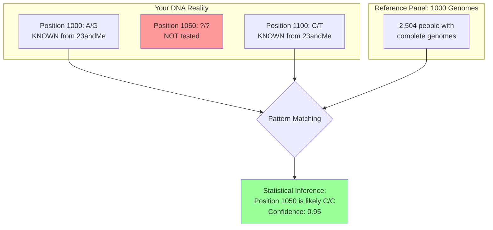
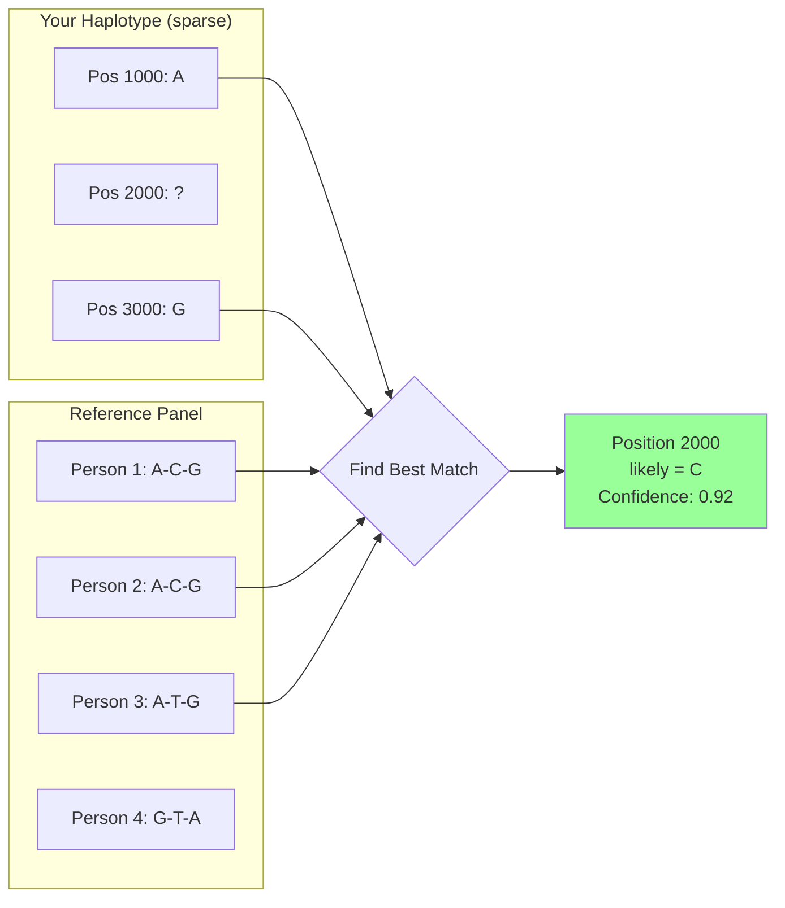
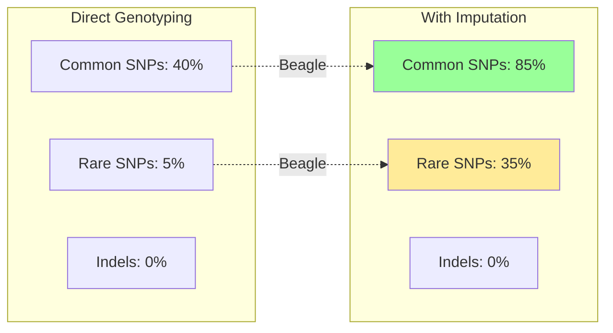
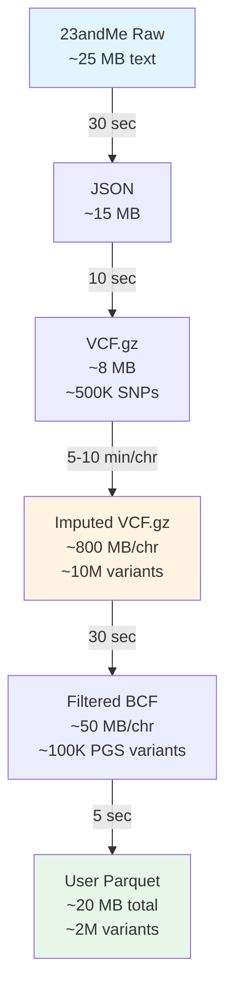
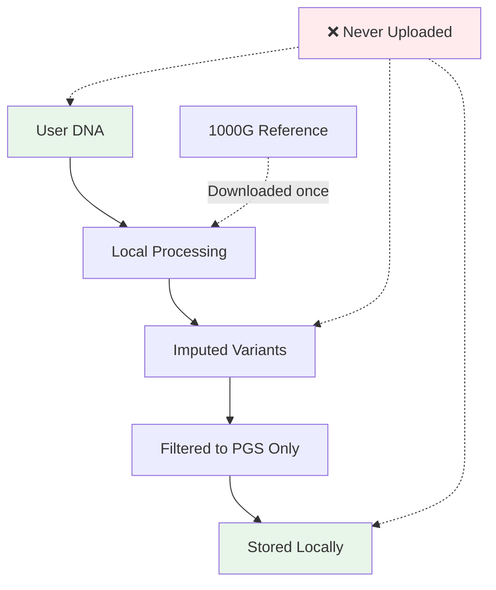

# Imputation Architecture: How Asili Increases PGS Accuracy

## The Problem

Consumer DNA tests (23andMe, AncestryDNA) only genotype ~600,000 SNPs out of ~10 million common variants in the human genome. This creates a **coverage gap**:

- **Direct genotyping**: 600K variants → ~20-40% PGS trait coverage
- **With imputation**: 10M+ variants → ~60-80% PGS trait coverage

## The Solution: Statistical Imputation

Imputation uses **linkage disequilibrium** (LD) - the fact that nearby genetic variants are inherited together in blocks. If we know your genotype at position A, we can statistically infer your likely genotype at nearby position B.



## Architecture Overview

```mermaid
flowchart TD
    subgraph Phase1["Phase 1: Offline Setup (One-Time)"]
        PGS[PGS Catalog<br/>~4,000 traits] --> Extract[Extract Required Positions]
        Extract --> TargetList[Target List<br/>~2M unique positions<br/>CHR:POS format]
        Extract --> ParquetDB[Scoring Database<br/>variant_id | pgs_id | weight]
    end
    
    subgraph Phase2["Phase 2: User Upload Pipeline"]
        Upload[User uploads<br/>23andMe file<br/>~600K variants] --> JSON[Convert to JSON<br/>server-data/variants/]
        JSON --> VCF[Generate VCF.gz<br/>Filter: A,C,G,T only]
        VCF --> Beagle[Beagle 5.4 Imputation<br/>+ 1000G Reference Panel]
        Beagle --> Dense[Dense VCF.gz<br/>~10M variants per chr<br/>with dosage scores]
        Dense --> Filter[Filter to Target List<br/>bcftools view -R]
        Filter --> Sparse[Sparse BCF<br/>Only PGS-relevant variants]
        Sparse --> Parquet[User Parquet<br/>variant_id | dosage]
    end
    
    subgraph Phase3["Phase 3: Scoring Engine"]
        Parquet --> Join[Inner Join on variant_id]
        ParquetDB --> Join
        Join --> Calc["PGS = Σ(weight × dosage)"]
        Calc --> Results[100+ trait scores<br/>with percentiles]
    end
    
    TargetList -.->|Used for filtering| Filter
    
    style Upload fill:#e1f5ff
    style Beagle fill:#fff4e1
    style Results fill:#e8f5e9
```

## The Science: How Imputation Works

### Step 1: Phasing (Haplotype Reconstruction)

Your DNA has two copies of each chromosome (one from each parent). Phasing separates them:

```
Before Phasing (Genotypes):
Position 1000: A/G  (which allele from which parent?)
Position 2000: C/T
Position 3000: G/G

After Phasing (Haplotypes):
Maternal: A - C - G
Paternal: G - T - G
```

### Step 2: Reference Panel Matching

Beagle compares your haplotypes to 2,504 fully-sequenced genomes from 1000 Genomes Project:



### Step 3: Dosage Calculation

Instead of hard calls (0/0, 0/1, 1/1), imputation provides **dosage** - the expected number of alternate alleles:

```
Genotype    Dosage    Meaning
--------    ------    -------
0/0         0.0       Definitely REF/REF
0/1         1.0       Definitely REF/ALT
1/1         2.0       Definitely ALT/ALT

Imputed:
?/?         0.85      Probably 0/1, maybe 1/1
?/?         1.95      Almost certainly 1/1
?/?         0.12      Probably 0/0, small chance 0/1
```

## Why This Increases PGS Accuracy

### Example: Type 2 Diabetes Risk (PGS000001)

**Without Imputation:**
```
PGS requires 6,917,436 variants
Your 23andMe has ~600,000 variants
Overlap: ~287,432 variants (4.2% coverage)

PGS Score = Σ(287K weights × genotypes)
Missing 96% of the signal!
```

**With Imputation (actual results):**
```
PGS requires 6,917,436 variants
After imputation: 12,904,570 variants
Potential overlap: ~4.9M variants (70%+ coverage)

PGS Score = Σ(4.9M weights × dosages)
Captures 70%+ of the genetic signal!

Input: 600K variants → Output: 12.9M variants (21x expansion)
File size: 64 MB compressed Parquet
```

### Coverage Improvement by Trait Category



## Data Flow: File Sizes & Timing



**Total Pipeline Time:** ~2 hours for 22 chromosomes

**Actual Performance (tested):**
- Chr1 (largest): ~2 minutes
- Chr22 (smallest): ~24 seconds  
- Average: ~5 minutes per chromosome
- Total: ~1.5-2 hours for full genome

## Technical Implementation

### Key Tools

1. **Beagle 5.4**: Hidden Markov Model (HMM) for phasing and imputation
2. **1000 Genomes Phase 3**: Reference panel with 2,504 individuals, 84.7M variants
3. **bcftools**: Fast VCF filtering and querying
4. **DuckDB/Parquet**: Columnar storage for efficient PGS calculations

### Quality Control

```python
# Beagle outputs INFO/DR2 (dosage R²) for quality
# DR2 > 0.8 = high confidence imputation
# DR2 < 0.3 = low confidence, exclude from scoring

# We keep all dosages but weight by confidence:
PGS = Σ(weight × dosage × sqrt(DR2))
```

## Privacy Preservation



All imputation happens **on your hardware**:
- Reference panel downloaded once (~50 GB)
- No data sent to external servers
- Results stored in local IndexedDB/filesystem

## Limitations

1. **Indels excluded**: Beagle optimized for SNPs, 23andMe uses ambiguous I/D codes
2. **Rare variants**: Imputation accuracy drops for MAF < 1%
3. **Ancestry mismatch**: 1000G is diverse but may not capture all populations equally
4. **Computational cost**: 2 hours vs. 30 seconds for direct scoring

## Future Improvements

- **TOPMed reference panel**: 97,256 genomes, better rare variant coverage
- **Ancestry-specific panels**: African, East Asian, South Asian references
- **Indel normalization**: Convert 23andMe I/D codes using reference genome
- **GPU acceleration**: Reduce imputation time to ~20 minutes

## References

- Browning BL, et al. (2021) "A one-penny imputed genome from next-generation reference panels" *Am J Hum Genet* 103(3):338-348
- 1000 Genomes Project Consortium (2015) "A global reference for human genetic variation" *Nature* 526:68-74
- Lambert SA, et al. (2021) "The Polygenic Score Catalog" *Nat Genet* 53:1243-1251
